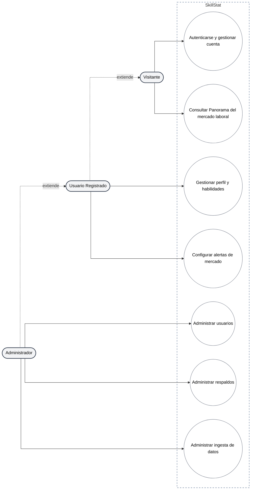

# Diagrama de Casos de Uso - Vista de Alto Nivel

Este diagrama agrupa los treinta y tres casos de uso técnicos reales (ver [diagrama-casos-de-uso-completo.md](./diagrama-casos-de-uso-completo.md)) en capacidades funcionales de negocio, pensado para presentación y para lectura rápida del alcance del sistema, alineado con lo que evalúa el Requisito 7 (CRUD, autenticación y validaciones) de la materia.

## Correspondencia con el diagrama completo

| Capacidad | Casos de uso técnicos agrupados |
|---|---|
| Autenticarse y gestionar cuenta | Registro, login (password y Google), logout, verificación de correo, recuperación de contraseña |
| Gestionar perfil y habilidades | Ver/actualizar perfil, cambiar contraseña, brecha de habilidades, agregar/eliminar habilidad |
| Configurar alertas de mercado | Crear, listar, eliminar, activar/desactivar alerta |
| Consultar Panorama del mercado laboral | Catálogos, resumen, ranking, tendencias, distribución geográfica, salarios, comparación |
| Administrar usuarios | Listar usuarios, cambiar rol, cambiar estado |
| Administrar respaldos | Ejecutar, listar, restaurar respaldo |
| Administrar ingesta de datos | Disparar ingesta de vacantes |
