# Diagrama de Casos de Uso - Vista Completa

Este diagrama enumera cada caso de uso técnico real del sistema, derivado directamente de los endpoints expuestos en los cinco controladores del backend (`admin_bp`, `alerts_bp`, `auth_bp`, `panorama_bp`, `profile_bp`). No es una representación conceptual del negocio: cada nodo corresponde a una ruta HTTP real y verificable en el código.

El actor Administrador extiende al Usuario Registrado (relación de generalización): todo lo que puede hacer un Usuario Registrado, también puede hacerlo un Administrador, más las operaciones exclusivas de gestión. El actor Visitante representa a cualquier consumidor sin autenticación, dado que los endpoints de Panorama no requieren `jwt_required()`.

```mermaid
%%{init: {"flowchart": {"curve": "stepBefore"}}}%%
flowchart LR
    %% Actores
    Visitante(["Visitante"])
    Registrado(["Usuario Registrado"])
    Admin(["Administrador"])

    %% Herencia de actores
    Registrado -.->|extiende| Visitante
    Admin -.->|extiende| Registrado

    %% Límite del Sistema
    subgraph Sistema["SkillStat"]
        %% Bloque Visitante
        UC1(("Registrarse"))
        UC2(("Iniciar sesión con contraseña"))
        UC3(("Iniciar sesión con Google"))
        UC4(("Cerrar sesión"))
        UC5(("Verificar correo"))
        UC6(("Reenviar verificación de correo"))
        UC7(("Solicitar recuperación de contraseña"))
        UC8(("Restablecer contraseña"))
        UC19(("Ver catálogo de habilidades"))
        UC20(("Ver catálogos combinados"))
        UC21(("Ver resumen general del mercado"))
        UC22(("Ver ranking de habilidades top"))
        UC23(("Ver tendencia de una habilidad"))
        UC24(("Ver distribución geográfica"))
        UC25(("Ver estadísticas salariales"))
        UC26(("Comparar habilidades"))

        %% Bloque Registrado
        UC9(("Ver perfil propio"))
        UC10(("Actualizar perfil"))
        UC11(("Cambiar contraseña"))
        UC12(("Ver brecha de habilidades"))
        UC13(("Agregar habilidad al perfil"))
        UC14(("Eliminar habilidad del perfil"))
        UC15(("Crear alerta"))
        UC16(("Listar alertas propias"))
        UC17(("Eliminar alerta"))
        UC18(("Activar o desactivar alerta"))

        %% Bloque Admin
        UC27(("Disparar ingesta de vacantes"))
        UC28(("Ejecutar respaldo manual"))
        UC29(("Listar respaldos"))
        UC30(("Restaurar respaldo"))
        UC31(("Listar usuarios"))
        UC32(("Cambiar rol de usuario"))
        UC33(("Cambiar estado de usuario"))
    end

    %% Relaciones Visitante
    Visitante --> UC1 & UC2 & UC3 & UC5 & UC6 & UC7 & UC8
    Visitante --> UC19 & UC20 & UC21 & UC22 & UC23 & UC24 & UC25 & UC26

    %% Relaciones Registrado
    Registrado --> UC4 & UC9 & UC10 & UC11 & UC12 & UC13 & UC14
    Registrado --> UC15 & UC16 & UC17 & UC18

    %% Relaciones Admin
    Admin --> UC27 & UC28 & UC29 & UC30 & UC31 & UC32 & UC33

    %% Estilos UML (Neutros)
    classDef actor fill:#f3f4f6,stroke:#374151,stroke-width:2px,color:#000
    classDef uc fill:#ffffff,stroke:#6b7280,stroke-width:1px,color:#000

    class Visitante,Registrado,Admin actor
    class UC1,UC2,UC3,UC4,UC5,UC6,UC7,UC8,UC9,UC10,UC11,UC12,UC13,UC14,UC15,UC16,UC17,UC18,UC19,UC20,UC21,UC22,UC23,UC24,UC25,UC26,UC27,UC28,UC29,UC30,UC31,UC32,UC33 uc
    style Sistema fill:transparent,stroke:#94a3b8,stroke-width:2px,stroke-dasharray: 5 5
```

## Notas de fidelidad al código

`UC9` (Ver perfil propio) representa dos rutas técnicamente distintas y activas simultáneamente: `GET /auth/me` y `GET /profile/me`, registrado como deuda técnica pendiente de consolidación (ver DT-25). Este diagrama las representa como un único caso de uso porque su propósito funcional es idéntico, no porque el código ya esté unificado.

Los ocho casos de uso de Panorama (`UC19` a `UC26`) no requieren autenticación en el código real; se muestran accesibles también para Usuario Registrado y Administrador por la relación de generalización, no porque existan rutas separadas para cada rol.
