# Diagrama de Clases

Este diagrama representa la estructura de clases de los modelos del dominio, derivada directamente de los trece modelos SQLAlchemy en `backend/app/models/`. A diferencia del [modelo entidad-relación](./modelo-entidad-relacion.md), que expresa cardinalidad a nivel de tablas, este diagrama expresa la estructura a nivel de clases Python: atributos tipados, visibilidad, y métodos reales.

La mayoría de estas clases son modelos de datos puros (Active Record vía SQLAlchemy), sin lógica de negocio propia solo tres declaran un método explícito (`__repr__`), usado exclusivamente para representación en logs y depuración, no para lógica de dominio. Este diagrama no inventa métodos que no existen en el código: donde una clase no tiene métodos propios, se muestra únicamente con sus atributos.

```mermaid
%%{init: {'theme': 'base', 'themeVariables': { 'primaryColor': '#ffffff', 'primaryBorderColor': '#6b7280', 'lineColor': '#6b7280', 'textColor': '#000000', 'clusterBkg': 'transparent', 'clusterBorder': '#94a3b8'}}}%%
classDiagram
    direction LR

    namespace Usuarios_y_Autenticacion {
        class User {
            +int id
            +string email
            +string first_name
            +string last_name
            +string password_hash
            +string role
            +datetime created_at
            +datetime password_changed_at
            +string intent
            +datetime email_verified_at
            +boolean is_active
            +__repr__() string
        }
        class OAuthAccount {
            +int id
            +int user_id
            +string provider
            +string provider_user_id
            +datetime created_at
            +__repr__() string
        }
        class PasswordResetToken {
            +int id
            +int user_id
            +string token_hash
            +datetime expires_at
            +datetime used_at
            +datetime created_at
            +__repr__() string
        }
        class EmailVerificationToken {
            +int id
            +int user_id
            +string token_hash
            +datetime expires_at
            +datetime used_at
            +datetime created_at
            +__repr__() string
        }
        class Backup {
            +int id
            +int user_id
            +string filename
            +string storage_url
            +datetime created_at
            +string status
            +bigint file_size_bytes
        }
    }

    namespace Intersecciones {
        class UserSkill {
            +int user_id
            +int skill_id
            +datetime created_at
        }
        class Alert {
            +int id
            +int user_id
            +int skill_id
            +string alert_type
            +int threshold_value
            +decimal threshold_percentage
            +boolean active
            +datetime created_at
        }
    }

    namespace Nucleo_Mercado {
        class Category {
            +int id
            +string name
        }
        class Skill {
            +int id
            +string name
            +string canonical_name
            +int category_id
        }
        class Job {
            +int id
            +string source
            +string title
            +string company
            +int city_id
            +decimal salary_min
            +decimal salary_max
            +text raw_description
            +string description_hash
            +boolean processed
            +datetime created_at
            +datetime updated_at
        }
        class JobSkill {
            +int job_id
            +int skill_id
            +decimal confidence_score
            +datetime created_at
        }
    }

    namespace Geografia_y_Analitica {
        class City {
            +int id
            +string name
            +string state
            +string country
            +decimal lat
            +decimal lon
        }
        class TrendSnapshot {
            +int id
            +int skill_id
            +int city_id
            +date date
            +int demand_count
            +decimal growth_rate
            +decimal avg_salary
        }
    }

    %% 1. Relaciones de Usuarios (Internas al dominio)
    User "1" --> "many" OAuthAccount : vincula
    User "1" --> "many" PasswordResetToken : solicita
    User "1" --> "many" EmailVerificationToken : solicita
    User "0..1" --> "many" Backup : genera

    %% 2. Relaciones Puente (Conectan Usuarios con Core)
    User "1" --> "many" UserSkill : declara
    User "1" --> "many" Alert : configura
    Skill "1" --> "many" UserSkill : declarada por
    Skill "1" --> "many" Alert : monitoreada por

    %% 3. Relaciones Core Mercado
    Category "1" --> "many" Skill : clasifica
    Job "1" --> "many" JobSkill : requiere
    Skill "1" --> "many" JobSkill : detectada en

    %% 4. Relaciones Analíticas y Geográficas
    City "0..1" --> "many" Job : ubica
    City "0..1" --> "many" TrendSnapshot : ubica
    Skill "1" --> "many" TrendSnapshot : medida en
```

## Notas de fidelidad al código

La visibilidad `+` (pública) se aplica a todos los atributos porque SQLAlchemy no impone encapsulamiento real a nivel de columna; no existe distinción de atributos privados o protegidos en ninguno de los trece modelos.

`User` no declara `relationship()` hacia `PasswordResetToken` ni hacia `EmailVerificationToken`, aunque la relación existe a nivel de llave foránea con `ondelete="CASCADE"`. Este diagrama muestra la relación estructural real de la base de datos; el acceso a nivel de objeto ORM ocurre siempre a través del repositorio correspondiente, no por navegación directa desde `User`.
