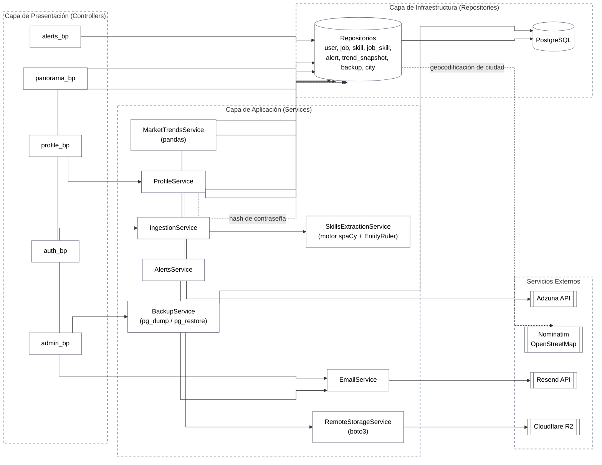

# Diagrama de Componentes

Este diagrama representa la arquitectura por capas real de SkillStat, derivada de los cinco controladores, los nueve servicios de `backend/app/services/`, y las integraciones externas confirmadas en el código. Los servicios nunca acceden a la base de datos directamente ni conocen Flask; median siempre a través de repositorios, según la regla explícita documentada en `backend/app/services/README.md`.

## Notas de fidelidad al código

`AdminBP` también invoca directamente a `MarketTrendsService` y `AlertsService` a través del endpoint `/trigger-pipeline`, ya representado en el [diagrama de secuencia de alertas](./diagrama-secuencia-alertas.md); se omite esa flecha aquí para no duplicar la misma relación en dos diagramas con propósitos distintos.

`BackupService` no delega en un repositorio para la ejecución física del respaldo, invoca `pg_dump`/`pg_restore` directamente vía `subprocess`, razón por la cual se conecta a `PostgreSQL` de forma directa en este diagrama, a diferencia del resto de los servicios que median siempre por `Repositorios`. Esta es una excepción real y documentada en el propio código (comentarios de `backup_service.py` explican la necesidad de cerrar la sesión de SQLAlchemy antes de invocar `pg_restore` para evitar deadlocks), no una inconsistencia del diagrama.

`RemoteStorageService` (Cloudflare R2) actúa como capa de resiliencia adicional sobre el respaldo local ya existente, nunca como mecanismo único: si R2 no está configurado o falla, el respaldo local generado por `BackupService` sigue siendo válido, según lo documentado en [ADR-006](../adr/ADR-006-cloudflare-r2-para-respaldo-remoto.md).
