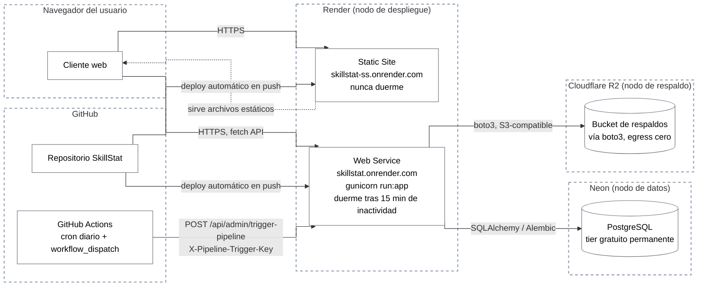

# Diagrama de Despliegue

Este diagrama representa la infraestructura real de producción de SkillStat, derivada directamente de las decisiones documentadas en [ADR-001](../adr/ADR-001-neon-como-proveedor-postgresql.md), [ADR-002](../adr/ADR-002-servicios-separados-backend-frontend.md) y [ADR-003](../adr/ADR-003-github-actions-como-disparador-pipeline.md).

## Notas de infraestructura

El Web Service experimenta cold start de 30 a 60 segundos tras 15 minutos de inactividad, consecuencia aceptada de la decisión documentada en ADR-002. El Static Site nunca duerme bajo el mismo tier, por lo que la carga inicial de la interfaz no sufre ese retraso, solo las llamadas subsecuentes a la API.

El disparo del pipeline diario ocurre exclusivamente vía GitHub Actions hacia el endpoint dedicado, autenticado con una API key de un solo propósito (ver [ADR-004](../adr/ADR-004-api-key-dedicada-para-pipeline.md)), completamente al margen del sistema de autenticación de usuarios.
