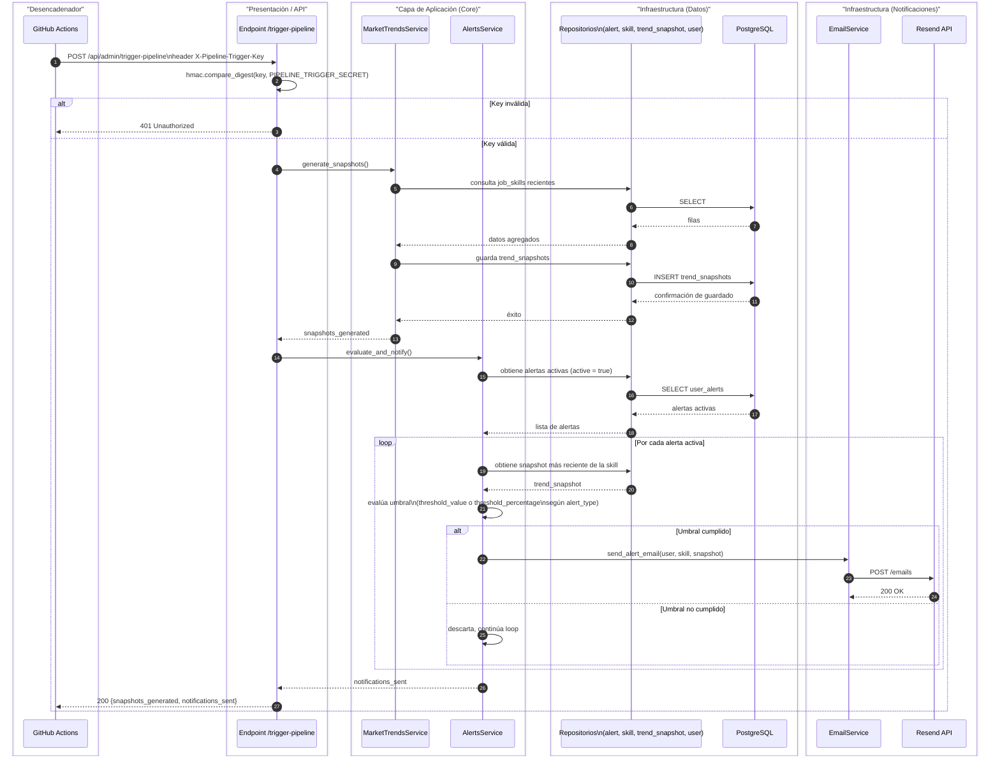

# Diagrama de Secuencia: Generación y Envío de Alertas

Este diagrama ilustra el flujo completo del pipeline diario de alertas, desde el disparo externo hasta la notificación al usuario. Es el flujo que representa el núcleo funcional de la propuesta de valor de SkillStat: la entrega proactiva de cambios relevantes en el mercado laboral, no solo su consulta pasiva.

Se eligió este flujo como el diagrama de secuencia ancla del proyecto por sobre el flujo de login, porque conecta directamente tres decisiones arquitectónicas ya documentadas ([ADR-003](../adr/ADR-003-github-actions-como-disparador-pipeline.md), [ADR-004](../adr/ADR-004-api-key-dedicada-para-pipeline.md)) con la lógica de negocio real del sistema.

## Notas del flujo

La autenticación del endpoint ocurre antes de cualquier trabajo real, descartando peticiones no autorizadas sin tocar la base de datos, según lo decidido en ADR-004.

La evaluación de umbral distingue entre alertas de tipo `ABSOLUTE` (comparación directa contra `threshold_value`) y `TREND` (comparación contra `threshold_percentage`), restricción impuesta a nivel de base de datos mediante `CheckConstraint` en el modelo `Alert`, no solo a nivel de lógica de aplicación.

El envío real de correos depende de Resend, actualmente en modo sandbox, lo que significa que solo la cuenta propietaria de la API key recibe correos reales sin importar cuántas alertas se generen para otros usuarios. Esta limitación queda documentada como deuda activa fuera del alcance de este diagrama.
