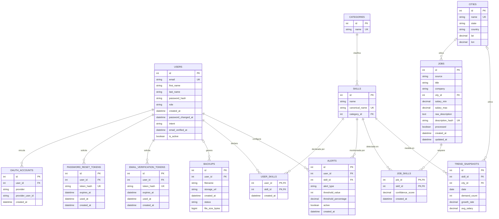

# Modelo Entidad-Relación

Este diagrama representa la estructura relacional completa de la base de datos de SkillStat, derivada directamente de los trece modelos SQLAlchemy definidos en `backend/app/models/`. Las cardinalidades y nulabilidades reflejan exactamente las restricciones declaradas en el código, no una interpretación aproximada del dominio.

`JobSkill` y `UserSkill` se modelan como entidades propias, no como simples líneas de relación muchos-a-muchos, porque ambas llevan llave primaria compuesta y columnas adicionales (`confidence_score` en la primera, `created_at` en ambas), cumpliendo con el patrón de Association Object que exige la tercera forma normal.

## Notación

`||` indica exactamente uno. `|o` indica cero o uno. `o{` indica cero o muchos. `|{` indica uno o muchos. `PK` marca llave primaria, `FK` llave foránea, `UK` restricción de unicidad.

## Notas estructurales

`PasswordResetToken` y `EmailVerificationToken` tienen su llave foránea configurada con `ondelete="CASCADE"`, así que al eliminar un usuario sus tokens pendientes se eliminan junto con él a nivel de base de datos, aunque el modelo `User` no declara `relationship()` explícita hacia ninguno de los dos, a diferencia del resto de sus relaciones. El acceso a esos tokens ocurre siempre a través de su repositorio correspondiente, no por
navegación directa desde el objeto usuario.

Las llaves foráneas nulables de este modelo son tres: `city_id` en `Job` y en `TrendSnapshot`, permitiendo vacantes o métricas sin geolocalización resuelta, y `user_id` en `Backup`, permitiendo respaldos automáticos ejecutados por el scheduler sin un usuario físico asociado.
